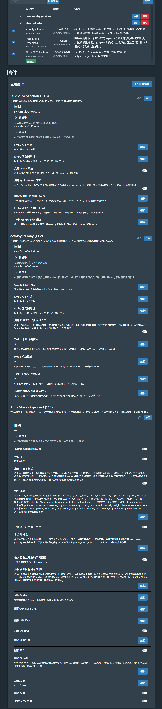

# Stash 对接 Emby 的全套解决方案

为 [Stash](https://github.com/stashapp/stash) 提供插件扩展功能，这是一个开源的媒体整理工具，本套插件有一套完善的针对emby的搭配设计，建议安装所有相关stash插件和以及需要的俩个emby插件配合使用。

**注意**：本项目中的 AutoMoveOrganized 插件基于 [zyd16888/AutoMoveOrganized](https://github.com/zyd16888/AutoMoveOrganized) 修改而来。

## 安装方法

在 Stash 中将此仓库添加为插件源：

1. 进入 **设置 → 插件 → 可用插件**
2. 点击 **添加源**
3. 输入 URL: `https://mayziran.github.io/StashtoEmby/stable/index.yml` 名称:StashtoEmby 本地路径：StashtoEmby
4. 点击 **重新加载**
5. 在 "StashtoEmby" 下浏览并安装可用插件

## 可用插件

### actorSyncEmby

将 Stash 中的演员信息（图片和 NFO 文件）导出到指定目录，并可选择性地将这些信息上传到 Emby 服务器。

**功能：**
- 同步演员基本信息到 Emby
- 自动下载并更新演员头像
- 支持批量同步操作
- 支持多种同步模式

[详细文档](https://github.com/mayziran/StashtoEmby/blob/master/plugins/actorSyncEmby/README.md)

### AutoMoveOrganized

在场景更新后，把已整理 (organized) 的文件移动到指定目录，并按模板重命名。

**功能：**
- 根据元数据自动移动文件
- 使用自定义模板重命名文件
- 支持批量处理
- 支持 Hook 模式（自动响应场景更新）和 Task 模式（手动批量处理）
- 生成 NFO 文件和下载封面图
- 🤖 **支持 AI 翻译元数据**（自动翻译场景标题和简介）

[详细文档](https://github.com/mayziran/StashtoEmby/blob/master/plugins/AutoMoveOrganized/README.md)

### StudioToCollection

将 Stash 工作室元数据同步到 Emby 合集（BoxSet）。

**功能：**
- 同步简介、图片（海报 + 徽标）、评分、外部 ID
- 同步别名和网址到简介
- 支持 Hook 自动响应（Studio.Update.Post / Studio.Create.Post）
- 支持 Task 批量同步

**配合说明：**
- **Jellyfin.Plugin.Stash**（Emby 插件）：负责创建合集、整理影片到合集
- **StudioToCollection**（Stash 插件）：负责同步工作室元数据到已有合集
- 两者互补，不冲突

[详细文档](https://github.com/mayziran/StashtoEmby/blob/master/plugins/StudioToCollection/README.md)

### Open in Emby

在场景/演员/工作室详情页和卡片添加"Open in Emby"按钮，通过 Stash ID 匹配 Emby 中的内容并跳转到详情页。

**功能：**
- 多位置按钮：场景/演员/工作室详情页和卡片页面
- 通过 Stash ID 精确匹配 Emby 视频/演员/工作室
- 支持双地址配置（内网 API 查询 + 外网网页跳转）

**前置依赖：** 需要 Emby 安装 [Jellyfin.Plugin.Stash](https://github.com/DirtyRacer1337/Jellyfin.Plugin.Stash) 插件

[详细文档](https://github.com/mayziran/StashtoEmby/blob/master/plugins/OpenInEmby/README.md)

---

## Emby 插件

### Emby.Plugin.StashBox

为 Emby 服务器提供 Stash-Box 外部 ID 支持，让你在 Emby 中可以直接跳转到 Stash-Box 网站查看场景详情。

**功能：**
- 支持 5 个 Stash-Box 实例（StashDB、ThePornDB、FansDB、JAVStash、PMV Stash）
- 每个实例可独立启用/禁用
- 支持源链接按钮：跳转到原始影片来源页面
- 在 Emby 影片详情页显示外部链接按钮
- 点击链接跳转到对应的 Stash-Box 网站或源页面

**安装方法：**

1. 从 [Releases](https://github.com/mayziran/StashtoEmby/releases) 下载 `Emby.Plugin.StashBox.dll`
2. 复制到 Emby 插件目录
3. 重启 Emby 服务器

**使用方法：**

1. 使用 AutoMoveOrganized 插件生成包含 Stash-Box ID 的 NFO 文件
2. 在 Emby 中刷新媒体库
3. 安装后，Emby 详情页会显示外部链接按钮，点击即可跳转到对应 Stash-Box 实例

**NFO 格式示例：**

```xml
<uniqueid type="stashdb">scenes\019bb7c5-xxxx-xxxx</uniqueid>
<uniqueid type="theporndb">scenes\7322d484-xxxx-xxxx</uniqueid>
```

**注意：** 使用反斜杠 `\`（Emby 会将 `/` 视为路径分隔符）

[详细文档](https://github.com/mayziran/StashtoEmby/blob/master/Emby.Plugin.StashBox/README.md)

---

### 💡 提示：如果你想跳转到本地 Stash

如果你想在 Emby 中跳转到**本地 Stash 服务器**，请使用：

**Jellyfin.Plugin.Stash**
- GitHub: https://github.com/DirtyRacer1337/Jellyfin.Plugin.Stash
- 功能：跳转到本地 Stash 服务器（如 `http://localhost:9999/scenes/{id}`）
- 适合：使用本地 Stash 管理影片，想快速访问的用户

> 💡 **同步工作室元数据到合集**：配合 Jellyfin.Plugin.Stash 使用，Jellyfin.Plugin.Stash 创建合集，StudioToCollection 同步元数据

---

## 插件设置页面



---

## 支持

- **问题反馈**: [GitHub Issues](https://github.com/mayziran/StashtoEmby/issues)
- **社区交流**: [Stash Discord](https://discord.gg/stashapp) | [Stash Discourse](https://discourse.stashapp.cc/)
