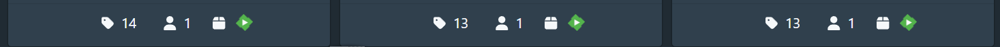
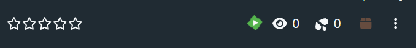

# Open in Emby

一个 Stash 插件，在场景、演员、工作室的详情页和卡片页面添加"Open in Emby"按钮，通过 Stash ID 匹配 Emby 中的内容并跳转到详情页。

## 功能特点

- 🔘 **多位置按钮** - 场景/演员/工作室详情页和卡片页面自动显示 Emby 跳转按钮
- 🔗 **Stash ID 匹配** - 通过 `stash.{id}` 精确匹配 Emby 视频/演员/工作室
- 🌐 **双地址支持** - 内网地址 API 查询，外网地址网页跳转

## 前置依赖

**必须配合 Emby 的 Stash 插件使用！**

- Emby 需要安装：[Jellyfin.Plugin.Stash](https://github.com/DirtyRacer1337/Jellyfin.Plugin.Stash)

## 安装

将 `OpenInEmby` 文件夹复制到 Stash 插件目录，重启 Stash。

## 配置选项

| 配置项 | 类型 | 描述 |
|--------|------|------|
| `Emby 服务器地址（跳转用）` | 字符串 | 用于网页跳转的外网地址 |
| `Emby 内网地址（API 用）` | 字符串 | 用于后端 API 请求的内网地址 |
| `Emby API Key` | 字符串 | Emby 控制台生成的 API 密钥 |

## 按钮位置

| 页面类型 | 按钮位置 |
|---------|---------|
| **场景详情页** | 工具栏（播放量按钮旁） |
| **演员详情页** | 标星评分后面（.quality-group） |
| **工作室详情页** | 标星评分后面（.quality-group） |
| **场景卡片** | 整理按钮后 |
| **演员卡片** | 影片数量后 |
| **工作室卡片** | 演员数量后 |

## 使用方法

1. 在 **设置 → 插件** 中配置上述三个参数
2. 打开任意场景/演员/工作室页面或卡片，会显示绿色的 **Emby 按钮**
3. 点击按钮即可跳转到 Emby 中对应的详情页

## 前提条件

- ✅ Emby 中已扫描视频文件
- ✅ Emby 已安装 Stash 插件并正确配置
- ✅ Stash 插件已匹配视频并写入 `ProviderIds.Stash`

## 故障排除

### 提示"未找到匹配"
- 检查 Emby 中是否已安装 Stash 插件
- 在 Emby 中刷新该视频的元数据

### 按钮不显示
- 确认在场景/演员/工作室页面或卡片页面

## 按钮截图

## 版本历史

### 1.1.0
- ✅ 新增演员/工作室详情页按钮（标星评分后面）
- ✅ 新增场景/演员/工作室卡片按钮
- ✅ 支持通过 `includeItemTypes` 参数搜索合集和演员
- ✅ 优化 UI：无外框设计，悬停时 logo 变亮
- ✅ 图标大小调整为 1.2em
- ✅ 移除沙漏动画，点击直接跳转
- ✅ 代码重构：UI 层/数据层/调度层三大模块

### 1.0.0
- 初始版本
- 场景详情页工具栏按钮
